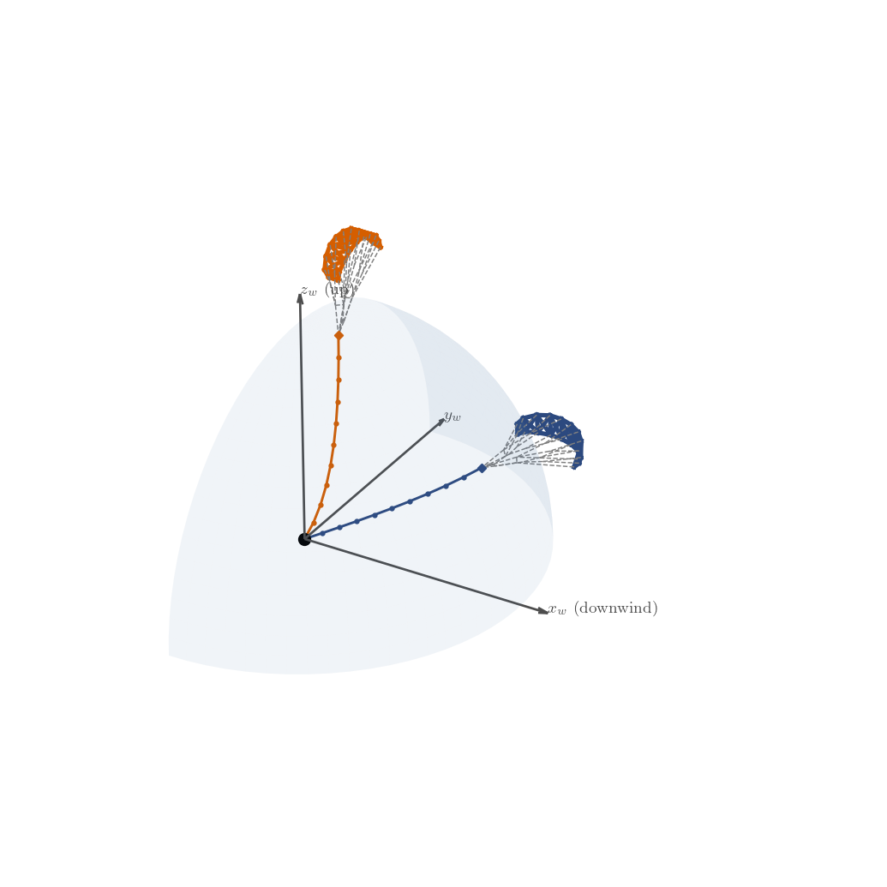
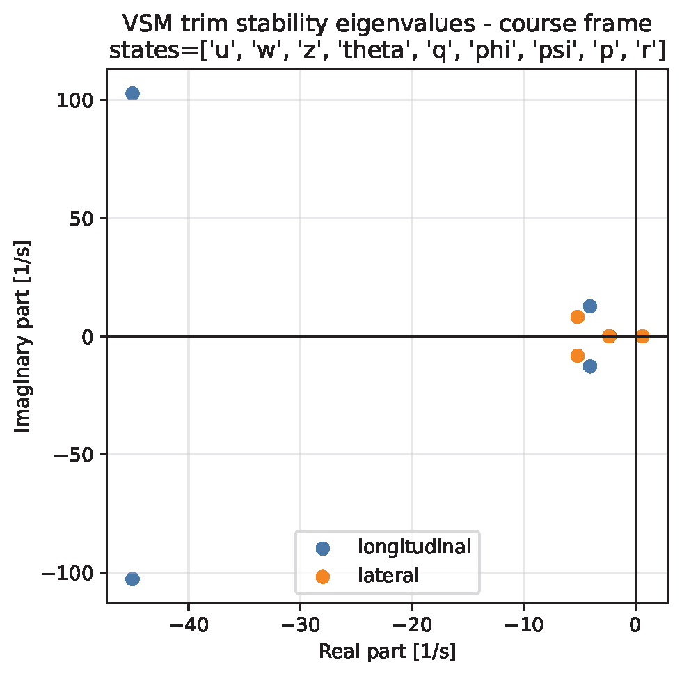
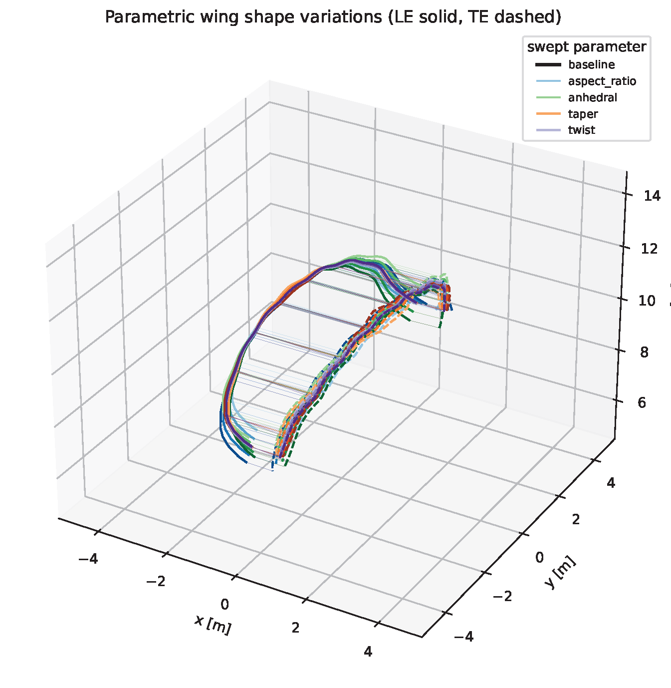
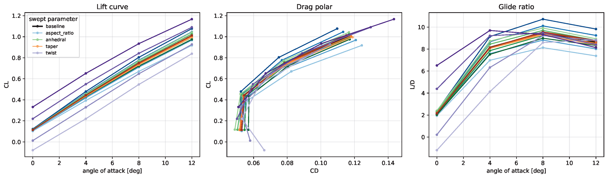

# Aerodynamics scripts

Runnable scripts built on the VSM quasi-steady trim layer
(`awetrim.aerodynamics.vsm_quasi_steady`) and the parametric geometry/airfoil
helpers. Run them from the project root.

Shared CLI helpers live in [`common.py`](common.py): the operating-point flags
(`--elevation-deg`, `--azimuth-deg`, `--course-deg`, `--wind-speed`,
`--radial-speed`, `--distance-radial`), `--vsm-src` (point at a local
Vortex-Step-Method checkout when it is not pip-installed), and `--output-dir`.
By default each script writes to `results/aerodynamics/<script_name>/`.

## Scripts

| Script | What it does | Key outputs |
|--------|--------------|-------------|
| [`solve_single_state.py`](solve_single_state.py) | Solves one VSM quasi-steady trim state for the kite at a chosen operating point. Optionally trims on a **deformed** shape from an aerostructural run (`--deformed-from <case_dir>`) and can close the trim with the distributed-mass `WilliamsTether`. | Trim summary (α, pitch, force coefficients), kite+tether 3-D figure, optional `--output-json`. |
| [`compute_stability_derivatives.py`](compute_stability_derivatives.py) | Computes the longitudinal and lateral aerodynamic stability derivatives about a trim point by finite-differencing the VSM trim, then assembles the linearised system to extract the flight-dynamic eigenmodes. Animates each eigenmode and draws its (non-dimensional) mode shape. | Stability-derivative JSON, eigenvalue/mode-shape figures, per-mode animated GIFs. |

### `parametric_shapes/`

Design-study scripts that morph the baseline geometry and re-evaluate it with VSM.

| Script | What it does | Key outputs |
|--------|--------------|-------------|
| [`parametric_shapes/generate_shape_variations.py`](parametric_shapes/generate_shape_variations.py) | Sweeps four planform degrees of freedom — aspect ratio, anhedral, taper, twist — from a baseline `aero_geometry.yaml` (quarter-chord anchored, area preserved). One-factor-at-a-time by default; `--factorial` for the full grid. Each variant is evaluated over an angle-of-attack sweep (`--no-run-vsm` to skip). | One morphed `aero_geometry.yaml` per variant, `summary.csv` of planform metrics, 3-D wing overlay and aero-comparison figures (lift curve, drag polar, glide ratio). |
| [`parametric_shapes/optimize_lei_airfoil.py`](parametric_shapes/optimize_lei_airfoil.py) | Optimises an LEI airfoil shape (6 profile parameters) with the Masure ML regression model via differential evolution, maximising `max_α(CL³/CD²)` inside a conservative parameter box near the trained data. | Optimised airfoil parameters and comparison plots vs. the baseline. |

## Example outputs

 

*Left: `solve_single_state.py` — kite and tether at two trim states in the wind frame. Right: `compute_stability_derivatives.py` — longitudinal and lateral trim eigenvalues in the course frame.*

 

*`parametric_shapes/generate_shape_variations.py` — swept planform variations (aspect ratio, anhedral, taper, twist) and the resulting lift curve, drag polar and glide ratio.*

